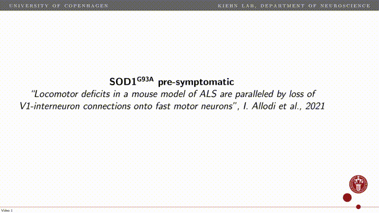

# README #

This repository consists of Python source code used for the bulk of treadmill analysis in
"[“Locomotor deficits in a mouse model of ALS are paralleled by loss of
V1-interneuron connections onto fast motor neurons”](https://www.biorxiv.org/content/10.1101/2020.06.23.166389v1)", I. Allodi et al. 2021

### How do I get set up? ###

* Python 3.7
* python main.py --data PATH_TO_VIDEOS

### Who do I talk to? ###

* raghav@di.ku.dk

